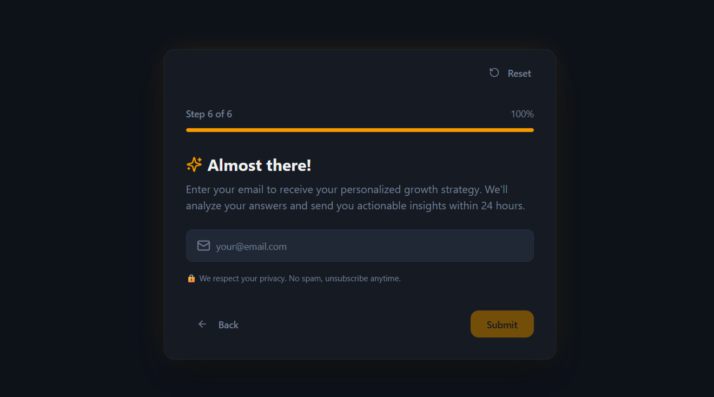
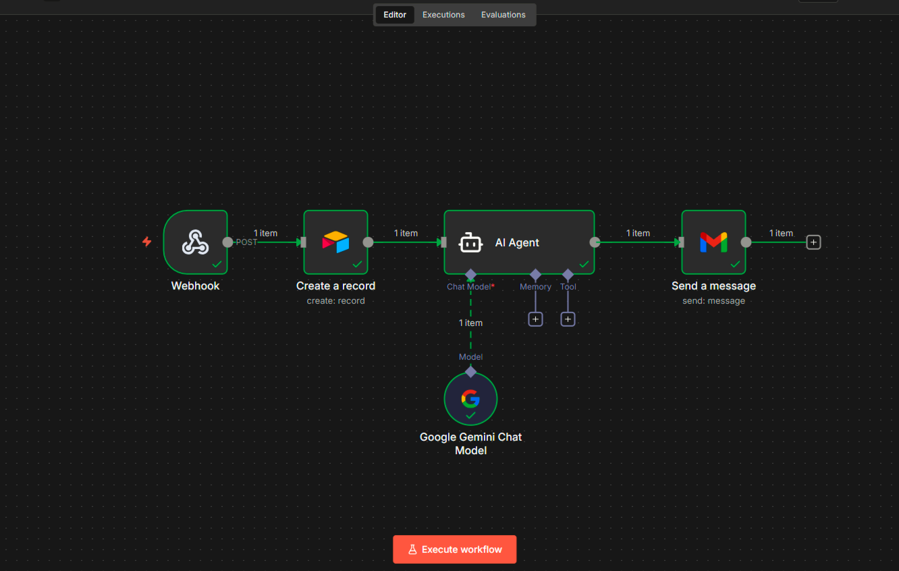

# 🚀 Lead Magnet Automation System

An end-to-end automated system that captures leads through an interactive form and delivers
AI-generated personalized solutions instantly via email.

This project is designed to go beyond basic lead collection by storing leads in Airtable
and providing real value through automated personalization.

## 🧠 How It Works (System Flow)
1. **Capture**: User fills out a multi-step form (Lovable).
2. **Trigger**: Data is sent to an **n8n** webhook via **ngrok**.
3. **Store**: Lead details are automatically logged in **Airtable**.
4. **Process**: AI Agent analyzes inputs to generate a custom solution.
5. **Deliver**: Personalized PDF/Message is sent via **Gmail**.

## ✨ Key Features
- **Interactive UI**: Smooth multi-step form experience.
- **Smart Processing**: AI-driven personalization (not just generic replies).
- **Centralized Leads**: Airtable integration for easy CRM management.
- **Scalable**: Built using modular n8n workflows.

## 🧩 Tech Stack
- **Frontend**: Lovable (Form UI)
- **Automation**: n8n
- **Database**: Airtable
- **AI**: Gemini / LLM Agent
- **Tunneling**: ngrok
- **Email**: Gmail API

## 🖼️ Workflow Visualization

### System Architecture

### n8n Workflow

